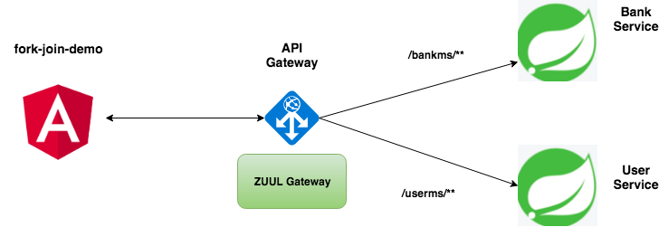

# fork-join-springboot-angular5

In parallel computing, fork–join is a way of setting up and executing parallel programs, such that execution branches off in parallel at designated points in the program, to "join" (merge) at a subsequent point and resume sequential execution. Parallel sections may fork recursively until a certain task granularity is reached. Fork–join can be considered a parallel design pattern.

<table>
 <tr>
    <th style="text-align:left">Name</th>
    <th style="text-align:left">Port</th> 
    <th style="text-align:left">Description</th>
  </tr>
  <tr>
    <td><a href="https://github.com/BarathArivazhagan/spring-cloud-sidecar-sample/tree/master/eureka-server"> bank-service</a></td>
    <td>9000</td>
    <td>Spring Boot Microservice</td>
  </tr>
  <tr>
    <td><a href="https://github.com/BarathArivazhagan/spring-cloud-sidecar-sample/tree/master/csstore-microservice">user-service</a></td>
    <td>9001</td>
    <td>Spring Boot Microservice</td>
  </tr>
  <tr>
    <td><a href="https://github.com/BarathArivazhagan/spring-cloud-sidecar-sample/tree/master/msstore-microservice">msstore-microservice</a></td>
    <td>9002</td>
    <td>Fork Join Demo</td>
  </tr>
  <tr>
    <td><a href="https://github.com/BarathArivazhagan/spring-cloud-sidecar-sample/tree/master/sidecar">sidecar</a></td>
    <td>9004</td>
    <td>Side car proxy for routing and filtering to wstore node app</td>
  </tr>
   <tr>
    <td><a href="https://github.com/BarathArivazhagan/spring-cloud-sidecar-sample/tree/master/wstore-node-express">api-gateway</a></td>
    <td>3000</td>
    <td>Zuul API Gateway</td>
  </tr>
  
</table>
